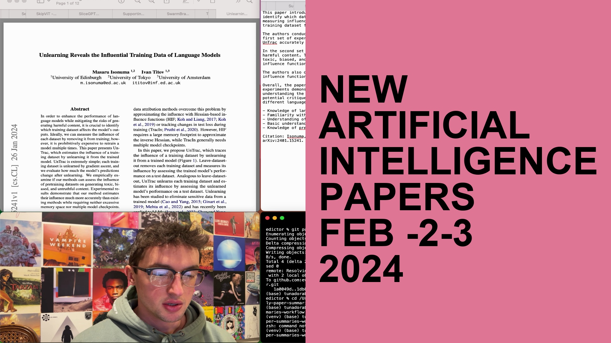

# daily-paper-summaries-workflow

## EXECUTIVE SUMMARY

This repo is public access to what I use for my youtube video daily AI paper breakdowns. 
https://youtube.com/playlist?list=PLPefVKO3tDxP7iFzaSOkOZnXQ4Bkhi9YB&si=J0Rmcmy-oVyAZI7I

One document `generate_multiple_reports.py` originates from one of David Shapiro's repos; the edits I've made to it are relatively minor
https://github.com/daveshap/Quickly_Extract_Science_Papers

Another document `arxiv-search.py` is a heavily edited version of https://github.com/bilalazh/Arxiv-Research-Pooler/tree/main

I don't think anybody will really find a majority of these files useful but who knows. The one I've been asked to share is `generate_multiple_prompts.py` which you could find a similar version of on Dave's repo. The only real difference with mine is that I adjusted it to use the longer 16k context window version of GPT-3.5 when that came out. The other file you may find useful is `arxiv-search.py` but it's pretty buggy, something to do with the arxiv api or api wrapper

## Repo Contents

- `arxiv-search.py` - this script downloads papers from arXiv.org according to search criteria specified in `search_terms_include.txt` and `search_terms_exclude.txt`. It assumes by default that you only want the most recent day of papers; to change this set `restrict_to_most_recent = False` inside `config.py`. 
    - sometimes this just won't work, in which case i'd recommend running it again. Something to do with either the arXiv API or the API wrapper not responding. Really not a big deal just run it a few times and one of them will work
    - `BUG` - the buttons are frequently unresponsive. I have to jump around a few windows back & forth to get it to work very frequently. Generally once it does start working I just don't leave that window. If anyone knows why `tkinter` does this pls lmk, but honeslty it's such a non-issue and I'm so tired that I'm not even gonna look it up. Likely will get fixed in future.
- `generate_multiple_reports.py` - this will consume all PDFs in the `pdfs-to-summarize/` folder and use OpenAI's API to generate summaries in the `txt-summaries/` folder. This is helpful for bulk processing such as for literature reviews. 
- `concatenate.py` - this will turn all txt summary files that have been copy & pasted from `txt-summaries/` to `txt-summaries/to-be-concatenated` into pdfs that I think are super useful for sharing. Basically it prepends the summary to the beginning of the original pdf. I often want to share scientific articles with friends but they usually don't want to read the whole thing, so giving them a version with a summary in the beginning is super useful.
- `send-to-obsidian.py` - this will take any txt files that have been copy & pasted from `txt-summaries/` to `txt-summaries/send-to-Obsidian` and send them and their pdf versions into your obsidian vault. You need to specify the location of your obsidian vault in `config.py` in order for it to work.
- `newsletter.py` - creates the actual newsletter that I publish daily to https://evintunador.substack.com?utm_source=navbar&utm_medium=web&r=1ixdk1 by concatenating all the summaries, and then having the chatGPT API do a little meta-summary intro to the newsletter. Saves to `newsletter.txt` which is what I copy & paste into substack
- `timestamps.py` - a script that generates youtube chapter timestamps based on the pdfs that have been summarized. Hit a configurable hotkey to (I use \`) to indicate that a new yt chapter should start, and `esc` to end the script. Creates `timestamps.txt` which is what I copy & paste into my yt description.
- `daily-thumbnail.py` - creates a simple thumbnail for my YT videos after they've been recorded. Basically a screenshot is taken from the video then the right half of the screen gets overlayed with a random color and either black or white text is written on that random color. By default the text says "New AI Papers Published MMM DD YYYY" but you can change this by calling it like in the example below.
    `python daily-thumbnail.py "path/to/video.mov" --text "Alternative\nTitle of\nYour Choice"`

- `cleanup.py` - Deletes all of the files that are generated by all the other scripts. I'd recommend running this after you download the repo since I've left it populated with a bunch of example txt and pdf files for example purposes
- `config.py` - Where you can change a couple settings if you'd like. 

## SETUP

1. Clone the repository to your local machine.
2. Install the required Python packages by running `pip install -r requirements.txt` in your terminal. *ngl I have not tested whether I put in all the requirements correctly, nor do i really even understand how a `requirements.txt` document is supposed to work.*
3. Obtain an API key from OpenAI and save it in a file named `key_openai.txt` in the root directory of the repository.
4. Run `cleanup.py` to get rid of all the pdf and text files that I may or may not have left in here on the most recent push
5. If you plan to send files to an Obsidian vault (if you don't know what this means ignore this step and the file `send-to-obsidian.py`) then open `config.py` and define directories for `your/obsidian/vault/location/here` and `your/obsidian/vault/location/here/attachments-folder`. Also inside `config.py` edit `frontmatter_lines` to your liking
6. Maybe peruse `config.py` to check settings and try to gain a better understanding of this monstrocity I've created. I suggest editing `prompts` to fit your use-case.

## USAGE

1. Write out your search terms in `search_terms_include.txt` and `search_terms_exclude.txt` to fit your use-case. Each search term should be on its own line. If you just want all of today's newest papers then leave both blank. For me personally I just exclude papers that I know I'm not going to be interested, for example anything related to the medical field. Also if you'd like to include more than the most recent day's papers then open up `config.py` and set `restrict_to_most_recent = False`. By default the maximum number of papers to include in search is 500, but again you can change this in `config.py`.
2. Run `arxiv-search.py`, wait for it to finish printing out every title and link to console, and then it should create a little app window. Expand this window and then you'll see a bunch of buttons with names of papers. Click on a paper and it'll be downloaded to `pdfs-to-summarize/`
    - If no papers show up and you get a blank window that's just either the arXiv API or the API wrapper bugging out. Just run it a couple times until it works. 
3. (Optionally skip to here) If you performed steps 1 & 2 then this folder should already have pdfs in it. Alternatively, you can manually fill `pdfs-to-summarize/` with a bunch of PDFs you'd like to see summarized. 
4. Run the `generate_multiple_reports.py` script to generate reports from the PDF files in the `pdfs-to-summarize/` directory. The generated reports will be saved as text files in the `txt-summaries/` directory.
5. (Option) IF you'd like to record timestamps for a youtube video of you talking abou the PDFs like I do, then run `timestamps.py` the moment you hit record. After you finish your video introduction, hit the hotkey (set to \` by default but changeable in `config.py`), and continue to hit the hotkey each time you get to a new pdf. Hit the hotkey a final time when you're finished reading each paper to create a timestamp for the outro to the video. When you stop recording click `esc` to save the timestamps to `timestamps.txt`. Now copy those into the description of your YT video
6. Read through the summaries in `txt-summaries`. 
    4a. If there are any you'd like sent to your Obsidian vault along with their PDF version, copy & paste the txt file into `txt-summaries/send-to-obsidian/`. Then run `send-to-obsidian.py`
    4b. If there are any you'd like prepended to the beginning of their corresponding pdf file, copy & paste the txt file into `txt-summaries/to-be-concatenated/`. Then run `concatenate.py` and they will apprear in `concatenated-summaries/`. This is useful for getting the summary and the file itself into one document. Great for sharing with people who may be interested but don't necessarily want to read the whole thing.
7. (Option) IF you'd like to start your own auto-generated pdf summary newsletter, then run `newsletter.py` and copy & paste the outputted contents of `newsletter.txt` into your newsletter. Don't forget to edit `newsletter_prompt` in `config.py` to cater it to your needs (right now it'll think your name is also Tunadorable).
8. With your recorded video call `python daily-thumbnail.py "path/to/your/video.mov"` or if you'd like to change the title on the thumbnail from its default (which is `"New\nAI\nPapers\nMMM DD\nYYYY"`) instead call `python daily-thumbnail.py "path/to/your/video.mov" --text "Alternative\nTitle\nOf Your\nChoice"`. 
9. Once you're finished and have saved all temporary files that you'd like to keep to a different directory, run `cleanup.py` to delete all files created by the previous scripts.

## NOTE

This codebase is an absolute shitshow and the only things most people will find useful are `arxiv-search.py` and `generate_multiple_reports.py`, the latter of which which wasn't even written by me, that was 99% Dave Shapiro. Again go check out his repo https://github.com/daveshap/Quickly_Extract_Science_Papers and his youtube channel https://www.youtube.com/@4IR.David.Shapiro

Also shoutout to Bilal from my Discord for writing the original version of `arxiv-search.py` which you can find over on https://github.com/bilalazh/Arxiv-Research-Pooler/tree/main 
